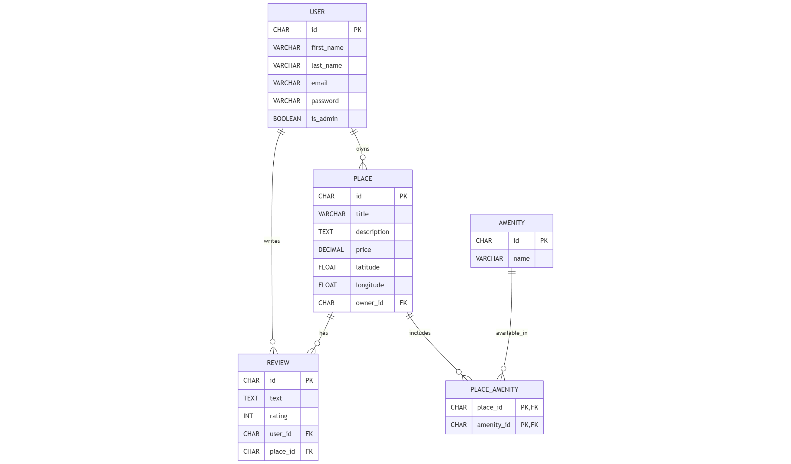

# 🏠 HBnB - Part 3: API, Authentication & SQLAlchemy

## 📌 Overview

This is Part 3 of the HBnB project, extending the RESTful API with secure authentication, admin authorization, and SQLAlchemy-based persistence. The goal is to move from in-memory data to a robust database-backed backend with complete access control.

---
## Entity-Relationship Diagram



## 🧩 Features

- ✅ JWT Authentication (`/api/v1/auth`)
- ✅ Role-based access control (`is_admin`)
- ✅ SQLAlchemy models with database persistence
- ✅ RESTful CRUD routes for:
  - Users
  - Places
  - Amenities
  - Reviews
- ✅ Admin bootstrap on startup
- ✅ SQLite for development, MySQL-ready for production
- ✅ ER diagram visualization with Mermaid.js

---

## 📂 Project Structure

part3/
├── app/
│ ├── api/
│ │ └── v1/
│ │ ├── auth.py
│ │ ├── users.py
│ │ ├── places.py
│ │ ├── reviews.py
│ │ └── amenities.py
│ ├── models/
│ │ ├── base_model.py
│ │ ├── user.py
│ │ ├── place.py
│ │ ├── review.py
│ │ └── amenity.py
│ └── services/
│ └── facade.py
├── diagrams/
│ └── er_diagram.png
├── schema.sql
├── data.sql
├── config.py
└── app/init.py

yaml
Copy
Edit

---

## 🔐 Authentication & Authorization

- `POST /api/v1/auth/login`: returns JWT access token
- Users can:
  - Access and modify their own data
  - Review others' places (1 review max per place)
- Admins can:
  - Create/update/delete any user, place, or review

---

## 🧠 Tech Stack

- **Flask**
- **SQLAlchemy**
- **Flask-JWT-Extended**
- **Flask-Bcrypt**
- **Flask-RESTx**
- **SQLite / MySQL**
- **Mermaid.js**

---

## 🧪 Testing & Usage

Run Flask with:

```bash
flask run
Launch the Flask shell:

bash
Copy
Edit
flask shell
To inspect the database (SQLite):

bash
Copy
Edit
sqlite3 test.db
🗃️ Initial Admin User
Auto-created on startup if not present:

makefile
Copy
Edit
Email:    admin@hbnb.com
Password: admin123
🖼️ ER Diagram

🛠️ SQL Schema + Seed
All tables and initial data can be recreated manually:

bash
Copy
Edit
sqlite3 test.db < schema.sql
sqlite3 test.db < data.sql

## Author

Written by:

**Joseph Gleason**  
Holberton School
```